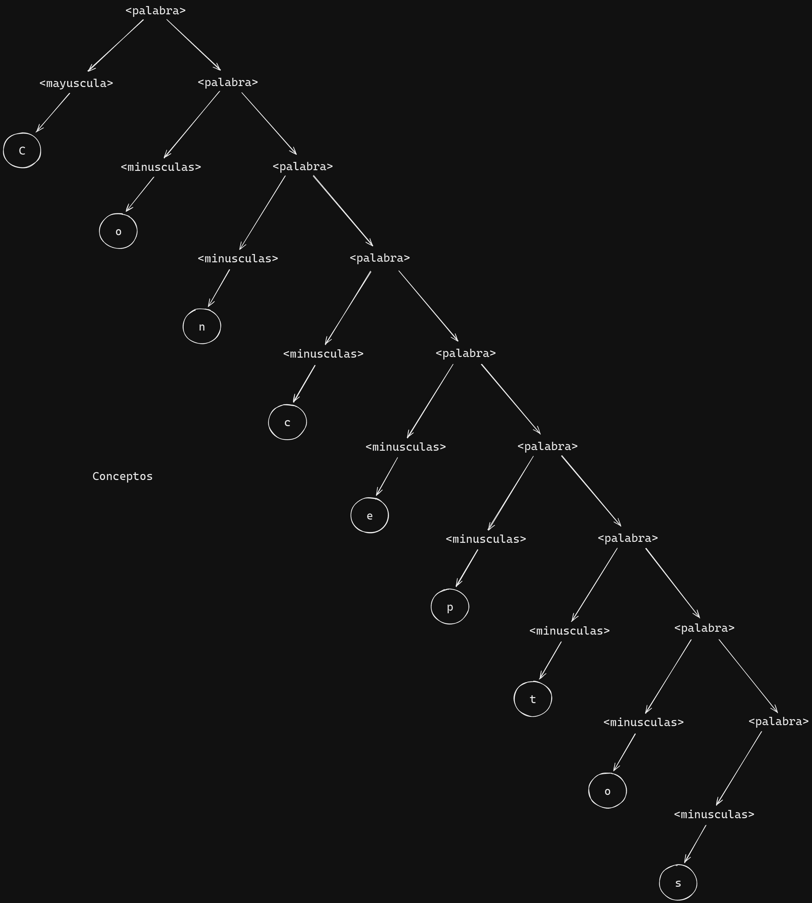

## Ejercicio 1:


## Ejercicio 2: 

### ¿Cuál es la importancia de la sintaxis para un lenguaje? ¿Cuáles son sus elementos?

La sintaxis de un lenguaje de programación es la estructura en que se organizan los distintos
elementos sintácticos, como espacios, identificadores, operadores, etc. Es decir, el orden que tienen
unos con respecto a otros.
Una sintaxis se evalúa según varios criterios: que sea fácil de leer, de escribir, de verificar (chequear
en busca de errores), fácil de traducir y que carezca de ambigüedad. Esta última significa que un
mismo código puede tener 2 o más interpretaciones o traducciones posibles, en cuyo caso no se
puede decidir que alternativa elegir.
Es muy importantes ya que establece las reglas para que el programador se comunique con el
procesador de forma correcta sintácticamente.

- Elementos de la sintáxis
    - Alfabeto o conjunto de caracteres
    - Identificadores
    - Operadores
    - Palabra clave y palabra reservada
    - Comentarios y uso de blancos


## Ejercicio 3: 
### ¿Explique a qué se denomina regla lexicográfica y regla sintáctica?

- Reglas léxicas: Conjunto de reglas para formar las “word”, a partir de los caracteres del
alfabeto

- Reglas sintácticas: Conjunto de reglas que definen como formar las “expresiones” y
“sentencias”

## Ejercicio 4:

### En la definición de un lenguaje, a qué se llama palabra reservadas? ¿A qué son equivalentes en la definición de una gramática? De un ejemplo de palabra reservada en el lenguaje que más conoce. (Ada,C,Ruby,Python,..)

En la definición de un lenguaje de programación, las "palabras reservadas" son aquellas que tienen un significado especial y están reservadas para ser utilizadas por el propio lenguaje. Estas palabras tienen funciones específicas dentro del lenguaje y no pueden ser redefinidas por el usuario para otros propósitos. Son parte de la sintaxis del lenguaje y tienen un significado predefinido

Un ejemplo de palabra reservada en el lenguaje Python es if. En Python, if se utiliza para iniciar una estructura condicional que ejecuta cierto bloque de código si una condición es verdadera. Esta palabra está reservada para este propósito y no se puede utilizar como nombre de variable u otro identificador en el código. 

```py

    x = 10

    if x > 5:
        print("x es mayor que 5")
    else:
        print("x no es mayor que 5")

```
## Ejercicio 5: 
### Dada la siguiente gramática escrita en BNF:
```py

    - G= ( N, T, S, P)
    - N = {<numero_entero>, <digito> }
    - T = {0, 1, 2, 3, 4, 5, 6, 7, 8, 9}
    - S = <numero_entero>
    - P = {
        <numero_entero> ::= <digito><numero_entero> | <numero_entero><digito> | <digito>
        <digito> ::= 0 | 1 | 2 | 3 | 4 | 5 | 6 | 7 | 8 | 9
    }

```


### a- Identifique las componentes de la misma

- G = ( N, T, S, P) son 4 tupla de Conjunto de reglas finita que define un conjunto infinito de posibles sentencias válidas en el lenguaje.

- N = Conjunto de símbolos no terminales
- T = Conjunto de símbolos terminales
- S = Símbolo distinguido de la gramática que pertenece a N
- P = Conjunto de producciones


### b- Indique porqué es ambigua y corríjala

Es ambigua por <digito><numero_entero> | <numero_entero><digito> La asociativa es por la izquierda o por la derecha, en este caso se estarían generando DOS arboles de derivación

```py

    - G= ( N, T, S, P)
    - N = {<numero_entero>, <digito> }
    - T = {0, 1, 2, 3, 4, 5, 6, 7, 8, 9}
    - S = <numero_entero>
    - P = {
        <numero_entero> ::= <digito><numero_entero> | <digito>
        <digito> ::= 0 | 1 | 2 | 3 | 4 | 5 | 6 | 7 | 8 | 9
}
```

## Ejercicio 6: 
### Defina en BNF (Gramática de contexto libre desarrollada por Backus- Naur) la gramática para la definición de una palabra cualquiera.


```py

    - G= ( N, T, S, P)
    - N = {<palabra>, <mayuscula>,<minuscula> }
    - T = {A...Z , a...z}
    - S = <palabra>
    - P = {
        <palabra> ::= <mayuscula><palabra> | <minusucla><palabra> | <minusculas> | <mayuscula> 
        <mayuscula> ::= A | B | C | D | E ... | Z 
        <minuscula> ::= a | b | c | d | e ... | z
        }
```
```py

    - G= ( N, T, S, P)
    - N = {<palabra>, <letra> }
    - T = {A...Z , a...z}
    - S = <palabra>
    - P = {
        <palabra> ::= <letra><palabra> | <letra> 
        <letra> ::= A | B | C | D | E ... | Z , a | b | c | d ... | z
    }
```

## Ejercicio 7: 

### Defina en EBNF la gramática para la definición de números reales. Inténtelo desarrollar para BNF y explique las diferencias con la utilización de la gramática EBNF.

```py
    EBNF

    - G= ( N, T, S, P)
    - N = {<real>, <digito> }
    - T = {0,1,2,3,4,5,6,7,8,9,"+","-",","}
    - S = <real>
    - P = {
        <real> ::= [(+|-)]{<digito>}^+ [,{<digito>}^+]
        <digito> ::= 0 | 1 | 2 | 3 | 4 | 5 | 6 | 7 | 8 | 9
    }
```

```py
    BNF

    - G= ( N, T, S, P)
    - N = {<real>, <entero_sin_signo>,<entero_con_signo>,<digito>,<decimal> }
    - T = {0,1,2,3,4,5,6,7,8,9,"+","-",","}
    - S = <real>
    - P = {
        
        <real> ::= <entero_con_signo> | <entero_con_signo><decimal>
        <entero_con_signo> ::= +<entero_sin_signo> | -<entero_sin_signo> | <entero_sin_signo>
        <entero_sin_signo> ::= <digito> | <digito><entero_sin_signo>
        <decimal> ::= ","<entero_sin_signo>
        <digito> ::= 0 | 1 | 2 | 3 | 4 | 5 | 6 | 7 | 8 | 9 
        
    }
```

BNF requiere definir muchas mas cosas que en EBNF no son necesarias porque se definen con los meta simbolos
BNF parece ser mas dificil de leer a comparacion de EBNF


## Ejercicio 8: 

### Utilizando la gramática que desarrolló en los puntos 6 y 7, escriba el árbol sintáctico de:

    a. Conceptos


- Opcion 1 :
    
- Opcion 2 :

    

###
    b. Programación


###
    c. 1255869


###
    d. 854,26


###
    e. Conceptos de lenguajes