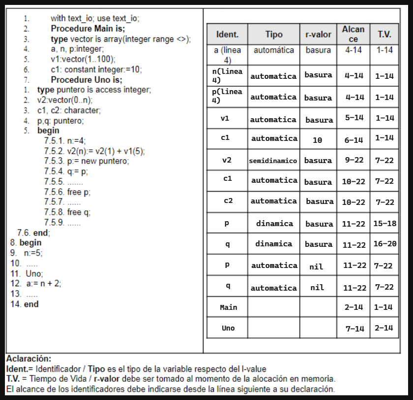
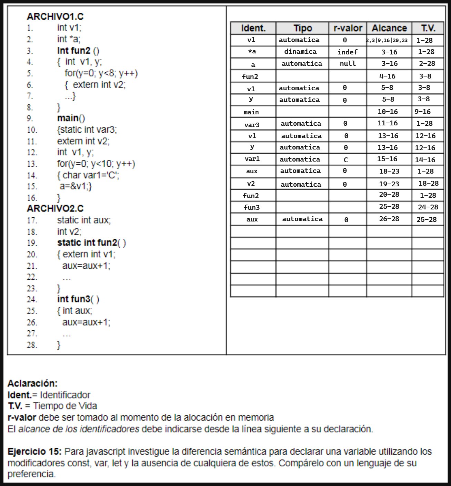

## Ejercicio 1: 
### Ejercicio 1: a) Tome una de las variables de la línea 3 del siguiente código e indique y defina cuales son sus atributos

```Pascal
    1.¿Procedure Practica4();
    2.var
    3.a,i:integer
    4.p:puntero
    5.Begin
    6.a:=0;
    7.new(p);
    8.p:= ^i
    9.for i:=1 to 9 do
    10.a:=a+i;
    11.end;
    12....
    13.p:= ^a;
    14....
    15.dispose(p);
    16.end;
```

Variable a:

- Nombre: a
- Alcance: Variable local , Estatico
- Tipo: Entero,ligadura estatica
- L-valor:Direccion de memoria
- R-valor:9
- T.V: 1-16


b) Compare los atributos de la variable del punto a) con los atributos de la variable de la línea 4. Que dato contiene esta variable?


Variable p:

- Nombre: p
- Alcance: Variable local , Estatico
- Tipo: Puntero,ligadura estatica
- L-valor:Direccion de memoria
- R-valor:Dinamico l-valor de i (linea 8) , l-valor de a (linea 13), dispose (linea 15)
- T.V: 1-16


## Ejercicio 2:
### a. Indique cuales son las diferentes formas de inicializar una variable en el momento de la declaración de la misma.

En algunos lenguajes existe la inicialización por defecto, donde los enteros se inicalizan en 0, los booleanos en false, los caracteres en blanco, las funciones en void, etc.

En muchos otros lenguajes, la inicialización por defecto no existe y las variables no inicializadas toman valores basura, lo que puede llevar a errores.

### b. Analice en los lenguajes: Java, C, Phyton y Ruby las diferentes formas de inicialización de variables que poseen. Realice un cuadro comparativo de esta característica.

| **Lenguaje** | |
| --- | --- |
| **Java** | - Declaración e inicialización separadas: `int num; num = 10;`<br>- Inicialización por defecto: `int num;` (inicializada a 0 automáticamente) |
| **C** | - Declaración e inicialización en la misma línea: `int num = 10;`<br>- Declaración e inicialización separadas: `int num; num = 10;`<br>- Las variables globales y estáticas se inicializan por defecto a 0 si no se les asigna un valor explícitamente.<br>- Las variables locales no tienen un valor por defecto y su valor inicial es impredecible, a menos que se les asigne un valor explícitamente. |
| **Python** | - Declaración e inicialización en la misma línea: `num = 10`<br>- No es necesario declarar el tipo de variable antes de su inicialización |
| **Ruby** | - Declaración e inicialización en la misma línea: `num = 10`<br>- No es necesario declarar el tipo de variable antes de su inicialización |


## Ejercicio 3: Explique los siguientes conceptos asociados al atributo l-valor de una:

- a. Variable estática.
- b. Variable automática o semiestática.
- c. Variable dinámica.
- d. Variable semidinámica.


El atributo l-valor de una variable hace referencia a su capacidad de ser referenciada o
manipulada mediante una expresión de asignación. En otras palabras, una variable con l-valor puede ser asignada a otra variable o valor.


a. Variable estática.

Una variable estática tiene un ámbito de visibilidad limitado a la función o archivo en el que se declara y su valor se mantiene constante durante toda la ejecución del programa. Es decir, es una variable que existe y se inicializa en tiempo de compilación y su valor persiste en memoria durante toda la ejecución del programa.

Ejemplo en C:

```C

#include <stdio.h>

void static_example() {
 static int num = 0;
 printf("El valor de num es: %d\n", num);
 num++;
}

int main() {
 for (int i = 0; i < 5; i++) {
 static_example();
 }
 return 0;
}

```
En este ejemplo, la variable num es una variable estática dentro de la función static_example().

La salida del programa sería:

- El valor de num es: 0
- El valor de num es: 1
- El valor de num es: 2
- El valor de num es: 3
- El valor de num es: 4

b. Variable automática o semiestática.

Una variable automática o semiestática se declara dentro de un bloque y su ámbito de
visibilidad se limita a ese bloque. Su valor se inicializa al entrar al bloque y se destruye al salir de él. Estas variables también se llaman locales, ya que solo son visibles dentro de la función en la que se declaran.

Ejemplo en Python:

```py

    def automatic_example():
        num = 0
        print("El valor de num es: ", num)
        num += 1

    for i in range(5):
        automatic_example()

    automatic_example().

```
La salida del programa sería:

- El valor de num es: 0
- El valor de num es: 0
- El valor de num es: 0
- El valor de num es: 0
- El valor de num es: 0

c. Variable dinámica.
Una variable dinámica es una variable que se crea y se destruye en tiempo de ejecución. En la
mayoría de los lenguajes de programación, estas variables se crean utilizando funciones o
métodos específicos como malloc() o new. El valor de una variable dinámica puede cambiar a
lo largo de la ejecución del programa.
Ejemplo en Python:

```py
def dynamic_example():
 num = input("Ingrese un número: ")
 print("El valor ingresado es:", num)
for i in range(5):
 dynamic_example()

```

En este ejemplo, la variable num es una variable dinámica que se inicializa mediante la entrada
de usuario en cada llamada a la función dynamic_example().
La salida del programa dependerá de lo que ingrese el usuario.
d. Variable semidinámica.
Una variable semidinámica es aquella cuyo tamaño puede cambiar durante la ejecución del
programa, pero solo se puede ajustar su tamaño en ciertos puntos de control predefinidos. Un
ejemplo de una variable semidinámica en ADA podría ser una matriz cuyo tamaño se puede
ajustar en tiempo de ejecución, pero solo en un punto de control específico del programa.
Ejemplo en ADA:

```C

with Ada.Text_IO; use Ada.Text_IO;
procedure Ejemplo_Variable_Semidinamica is
 type Matriz is array (Positive range <>, Positive range <>) of Integer;
 -- Definición de una matriz de tipo semidinámico
 Filas, Columnas : Positive := 5; -- Tamaño inicial de la matriz
 M : Matriz (1..Filas, 1..Columnas); -- Inicialización de la matriz
begin
 -- Realizar alguna operación con la matriz inicial
 Put_Line("El tamaño actual de la matriz es " & Positive'Image(Filas) & "x" &
 Positive'Image(Columnas));
 -- En algún punto de control en el programa, ajustar el tamaño de la matriz
 Filas := 8;
 Columnas := 8;
 M := M (1..Filas, 1..Columnas); -- Ajustar el tamaño de la matriz
 -- Realizar alguna operación con la matriz actualizada
 Put_Line("El tamaño actual de la matriz es " & Positive'Image(Filas) & "x"
& Positive'Image(Columnas));
end Ejemplo_Variable_Semidinamica;

```

En este ejemplo, se define una matriz semidinámica llamada Matriz, que se puede ajustar en tiempo de ejecución. 
En la inicialización de la matriz, se define un tamaño inicial de 5 filas y 5 columnas. 
Luego, en un punto de control específico en el programa, se ajusta el tamaño de la matriz a 8 filas y 8 columnas. 
La variable Filas y Columnas se utilizan para controlar el tamaño actual de la matriz, y la sintaxis M := M (1..Filas, 1..Columnas); se utiliza para ajustar el tamaño
de la matriz en ese punto de control. 
Finalmente, se muestra por pantalla el tamaño actual de la matriz antes y después de ajustar su tamaño.


Investigue sobre que tipos de variables respecto de su l-valor hay en los lenguajes C y Ada.

En el lenguaje de programación C, se pueden clasificar las variables según su l-valor de la siguiente manera:


1. Variable estática: son variables que se almacenan en la memoria estática y mantienen
su valor entre llamadas a funciones. Estas variables se declaran con la palabra clave
"static" y se inicializan automáticamente en cero.

2. Variable automática: son variables que se almacenan en la memoria de la pila y se
eliminan automáticamente al salir de su ámbito de definición. Estas variables se
declaran sin la palabra clave "static" y su vida útil está limitada a su función o bloque
de código.

3. Variable dinámica: son variables que se asignan en tiempo de ejecución y se
almacenan en la memoria dinámica. Estas variables se crean utilizando las funciones
"malloc" o "calloc" y se liberan utilizando la función "free". Estas variables tienen una
vida útil que se extiende más allá de la función o bloque de código en el que se crean.


En el lenguaje de programación Ada, las variables se clasifican según su l-valor de la siguiente manera:

1. Variable estática: se definen usando la palabra clave "constant" o "static" y se
mantiene en memoria durante toda la ejecución del programa.

2. Variable automática o semiestática: se definen dentro de un bloque y se eliminan de la
memoria cuando el bloque termina.

3. Variable dinámica: se asignan en tiempo de ejecución usando la palabra clave "new".
Estas variables se mantienen en la memoria hasta que se libera explícitamente usando
la palabra clave "delete".

4. Variable semidinámica: una matriz cuyo tamaño se puede ajustar en tiempo de
ejecución, pero solo en un punto de control específico del programa.

## Ejercicio 4:
### a. ¿A qué se denomina variable local y a qué se denomina variable global?

Se denomina variable local a las variables declaradas en módulos, como funciones, procesos y procedimientos, y su tiempo de vida es acorde al tiempo de vida de estos módulos. No pueden ser accedidas afuera de éstos.

Se denominan variables globales a las variables que son declaradas en el programa principal y pueden ser accedidas en cualquier momento del programa, su tiempo de vida es acorde al tiempo de vida de la ejecución del programa.


### b. ¿Una variable local puede ser estática respecto de su l-valor? En caso afirmativo dé un ejemplo

Sí, es posible que una variable local sea estática respecto a su L-valor. Esto sucede cuando en un lenguaje de programación, se declara una variable local en una función de manera estática. Ejemplo en C:

```java

    void funcion() {
        static int x = 12;
        printf("El valor de x es: %d\n",x);
        x++;
    }

    int main() {
        funcion();
        funcion();
        return 0;
    }


```


### c. Una variable global ¿siempre es estática? Justifique la respuesta.

Una variable global es estática ya que se reserva espacio en memoria durante toda la ejecución del programa. Estará disponible para su utilización desde que el programa empieza a ejecutarse hasta que termine.

Sin embargo, es posible que su L-valor pueda ser cambiado durante la ejecución del programa. Es decir, la dirección de memoria donde esté almacenada puede ir cambiando dependiendo del contexto del programa.


### d. Indique qué diferencia hay entre una variable estática respecto de su l-valor y una constante

La diferencia entre una variable estática y una constante es que el L-valor de la variable estática puede ir cambiando a medida que se va ejecutando el programa, mientras que el L-valor de la constante no puede ser modificado y tiene una ubicación fija en la memoria, desde el principio hasta el final de la ejecución del programa.


## Ejercicio 5:
### a. En Ada hay dos tipos de constantes, las numéricas y las comunes. Indique a que se debe dicha clasificación.

Las constantes numéricas son constantes que representan números, enteros o reales.
Las constantes comunes son constantes que representan otro tipo de datos, como caracteres o Strings.

### b. En base a lo respondido en el punto a), determine el momento de ligadura de las constantes del siguiente código:

- H: constant Float:= 3,5;
- I: constant:= 2;
- K: constant float:= H*I


El momento de ligadura de la constante H es cuando se le asigna el valor 3,5.

El momento de ligadura de la constante I es cuando se le asigna el valor 2.


## Ejercicio 6: Sea el siguiente archivo con funciones de C:

```C
Archivo.c
    { int x=1; (1)
        int func1();{
        int i;
        for (i:=0; i < 4; i++) x=x+1;
        }
        int func2();{
            int i, j;
            /*sentencias que contienen declaraciones y
            sentencias que no contienen declaraciones*/
            ......
            for (i:=0; i < 3; i++) j=func1 + 1;
        }
    }
```

### Analice si llegaría a tener el mismo comportamiento en cuanto a alocación de memoria, sacar la declaración (1) y colocar dentro de func1() la declaración static int x =1;

Sí, tendría el mismo sentido en este caso que la variable x se declare como una variable estática dentro de func1 que sea una variable global como lo es en este caso. Esto se debe a que func1 está modificando el R-valor de x cada vez que se ejecuta, y esto se almacena en memoria. Si fuese una variable estática dentro de func1, la modificación en memoria pasaría de la misma manera y el resultado seguiría siendo el mismo.


## Ejercicio 7: Sea el siguiente segmento de código escrito en Java, indique para los identificadores si son globales o locales.

```java
Clase Persona {
    public long id
    public string nombreApellido
    public Domicilio domicilio
    private string dni;
    public string fechaNac;
    public static int cantTotalPersonas;
    
    //Se tienen los getter y setter de cada una de las variables
    
    //Este método calcula la edad de la persona a partir de la fecha de nacimiento
    
    public int getEdad(){
        public int edad=0;
        public string fN = this.getFechaNac();
        ...
        ...
        return edad;
    }
}


Clase Domicilio {
    public long id;
    public static int nro
    public string calle
    public Localidad loc;
    //Se tienen los getter y setter de cada una de las variables
}


```

Las variables globales son todas las variables de instancia estáticas, en este código serían nro en la clase Domicilio y cantTotalPersonas en la clase Persona, ya que pueden ser accedidas en cualquier momento del programa sin tener la necesidad de instanciar la clase.

Las variables que poseen el atributo public también son variables globales, ya que pueden ser accedidas por el programa, con la excepción de que hará falta instanciar un objeto de esa clase para que puedan ser accedidas. Si no se instancia un objeto de la clase Persona por ejemplo, entonces no será posible acceder a nombreApellido, ya que aunque sea de visibilidad pública no existe en memoria si no se instanció.

Las variables locales en este caso serían edad y fn dentro del método getEdad(), porque sólo existen el mismo tiempo de vida que la ejecución del método, una vez que éste deje de ser ejecutado no será posible acceder a éstas.


## Ejercicio 8: Sea el siguiente ejercicio escrito en Pascal

    1- Program Uno;
    2- type tpuntero= ^integer;
    3- var mipuntero: tpuntero;
    4- var i:integer;
    5- var h:integer;
    6- Begin
    7- i:=3;
    8- mipuntero:=nil;
    9- new(mipuntero);
    10- mipunterno^:=i;
    11- h:= mipuntero^+i;
    12- dispose(mipuntero);
    13- write(h);
    14- i:= h- mipuntero;
    15- End.

### a) Indique el rango de instrucciones que representa el tiempo de vida de las variables i, h y mipuntero.

i:1-15
h:1-15
mipuntero:1-15


### b) Indique el rango de instrucciones que representa el alcance de las variables i, h y mipuntero.

i:5-15
h:6-15
mipuntero:10-15

### c) Indique si el programa anterior presenta un error al intentar escribir el valor de h. Justifique

Tecnimanete hay un error semantico en la linea 10 esta mal escrito la variable mipuntero por lo que al momeno de escribir en h el valor de mipuntero^+1 fallaria. Si modificaramos eso y mipuntero estuviera bien escrito no fallaria y se asignaria bien el valor a h y se imprimiria correctamente el valor.

### d) Indique si el programa anterior presenta un error al intentar asignar a i la resta de h con mipuntero. Justifique

La linea 14 genera problemas ya que se esta asignando a i la resta de h junto mipuntero el cual previamente le hicieron un disponse.


### e) Determine si existe otra entidad que necesite ligar los atributos de alcance y tiempo de vida para justificar las respuestas anteriores. En ese caso indique cuál es la entidad y especifique su tiempo de vida y alcance.

Sí, la otra entidad es el mismo programa principal es el que otorga la ligadura, el tiempo de vida y el alcance. Su tiempo de vida es desde que empieza a ejecutarse en la línea 6 hasta que termina en la línea 15. Su alcance es global.


### f) Especifique el tipo de variable de acuerdo a la ligadura con el l-valor de las variables que encontró en el ejercicio

- La variable i es una variable de tipo entero.

- La variable h es una variable de tipo entero.

- La variable mipuntero es un puntero que almacena un entero.

## Ejercicio 9: Elija un lenguaje y escriba un ejemplo:

- a. En el cual el tiempo de vida de un identificador sea mayor que su alcance


- b. En el cual el tiempo de vida de un identificador sea menor que su alcance
- c. En el cual el tiempo de vida de un identificador sea igual que su alcance


## Ejercicio 10: Si tengo la siguiente declaración al comienzo de un procedimiento:

```
    int c; en C
    var c:integer; en Pascal
    c: integer; en ADA
```

    Y ese procedimiento NO contiene definiciones de procedimientos internos. ¿Puedo asegurar que el
    alcance y el tiempo de vida de la variable “c” es siempre todo el procedimiento en donde se encuentra
    definida?. Analícelo y justifique la respuesta, para todos los casos

Sí, se puede asegurar que como no hay procedimientos internos que puedan afectar su tiempo de vida o alcance, el tiempo de vida de las variables declaradas va a concordar con el alcance de los procedimientos. 


## Ejercicio 11: a) Responda Verdadero o Falso para cada opción. El tipo de dato de una variable es?

I) Un string de caracteres que se usa para referenciar a la variable y operaciones que se pueden realizar sobre ella. FALSO
II) Conjunto de valores que puede tomar y un rango de instrucciones en el que se conoce el nombre. FALSO
III) Conjunto de valores que puede tomar y lugar de memoria asociado con la variable. FALSO
IV) Conjunto de valores que puede tomar y conjunto de operaciones que se pueden realizar sobre esos valores. VERDADERO

### b) Escriba la definición correcta de tipo de dato de una variable

El tipo de una variable es el rango de valores que esa variable puede tomar y las operaciones permitidas que puede realizar. Se define el tipo de una variable como la especifiación del conjunto de valores que se pueden asociar a la variable y el conjunto de operaciones permitidas (crear, acceder, modificar). 


## Ejercicio 12: Sea el siguiente programa en ADA, completar el cuadro siguiente indicando para cada variable de que tipo es en cuanto al momento de ligadura de su l-valor, su r-valor al momento de alocación en memoria y para todos los identificadores cuál es su alcance y cual es su el tiempo de vida.

### Indicar para cada variable su r-valor al momento de alocación en memoria



## Ejercicio 13: El nombre de una variable puede condicionar:
- Su tiempo de vida: El nombre de una variable no condiciona el tiempo de vida de una variable. El tiempo de vida de una variable no depende del nombre que tenga.

- Su alcance: El nombre de una variable sí puede condicionar al tiempo de vida de la variable.  Si se declara una variable local a una función con el mismo nombre que una variable global, entonces dentro de la función se utilizará la variable global, condicionando su alcance

- Su r-valor: El nombre de una variable no condiciona su r-valor. El r-valor es el valor asignado a la variable mediante la asignación, y es independiente del nombre de la variable.

- Su tipo: El nombre de una variable no condiciona su tipo. Se pueden declarar variables de cualquier tipo con cualquier nombre, aunque lo ideal es que el nombre describa lo más claro posible a la variable.

## Ejercicio 14: Sean los siguientes archivos en C, los cuales se compilan juntos
    Indicar para cada variable de que tipo es en cuanto al momento de ligadura de su l-valor.
    Indicar para cada identificador cuál es su alcance y cual es su el tiempo de vida.
    Indicar para cada variable su r-valor al momento de alocación en memoria

