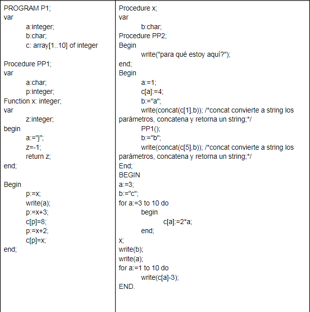

## Ejercicio 2: Dado el siguiente programa escrito en Pascal-like, continuar la realización de las pilas de ejecución hasta finalizar las mismas.

### a) Siguiendo la cadena estática 

### b) Siguiendo la cadena dinámica

## Ejercicio 3: Sea el siguiente programa escrito en Pascal-like. Realice la pila de ejecución

### a) Siguiendo la cadena estática

|  Dirección     | MAIN |
|-------|-----------------|
|   *1  | PTO Retorno     |
|       | a =A= ~~3..10~~ ~~3~~ ~~1~~  ~~1..10~~    |
|       | b  = "c"        |
|       | c(1)= ~~4~~ 1   |
|       | c(2)= 8         |
|       | c(3)=6          |
|       | c(4)=8          |
|       | c(5)=10         |
|       | c(6)=12         |
|       | c(7)=14         |
|       | c(8)=16         |
|       | c(9)=18         |
|       | c(10)=20        |
|       | Procedure PP1   |
|       | Procedure X     |
|       | VR              |
|       | ***Reg Activ x  |
|   *2  | PTO Retorno     |
|       | EE(1)           |
|       | ED(1)           |
|       | b = ~~"a"~~ "b" |
|       | VR ...          |
|       |***Reg Activ PP1 |
|   *3  | PTO Retorno     |
|       | EE(1)           |
|       | ED(2)           |
|       | a = "j"         |
|       | p = ~~-1~~ ~~ 2 ~~ 1      |
|       | Procedure PP2   |
|       | VR = -1         |
|       | ***Reg Activ x  |
|   *4  | PTO Retorno     |
|       | EE(3)           |
|       | ED(3)           |
|       | z =-1           |
|       | VR ...          |

MAIN

    Write: c
    Write: 1
    Write: -2,5,3,5,7,9,11,13,15,17

x

    Write: 4a
    Write: 10b

PP1

    Write: j

### b) Siguiendo la cadena dinámica

|  Dirección     | MAIN    |
|-------|------------------|
|  *1   | PTO Retorno      |
|       |a =A= ~~3..10~~ 1 |
|       | b  = "c"         |
|       | c(1)= ~~4~~ -1   |
|       | c(2)= 8          |
|       | c(3)=6           |
|       | c(4)=8           |
|       | c(5)=10          |
|       | c(6)=12          |
|       | c(7)=14          |
|       | c(8)=16          |
|       | c(9)=18          |
|       | c(10)=20         |
|       | Procedure PP1    |
|       | Procedure X      |
|       | VR               |
|       |Reg Activ X       |
|  *2   |PTO Retrono       |
|       |EE(1)             |
|       |ED(1)             |
|       |b=~~"a"~~ "b"     |
|       |Procedure PP2     |
|       | Reg Activ PP1    |
|    *3 | PTO Retorno      |
|       | EE(1)            |
|       | ED(2)            |
|       |a = "j"           |
|       |p = ~~-1~~ ~~2~~ 1|
|       |Function x        |
|       | VR= -1           |
|    *4 | Reg Activ x      |
|       | PTO Retorno      |
|       | EE(3)            |
|       | ED(3)            |
|       | z = -1           |
|       | VR               |
|    *5 | Reg Activ x      |
|       | PTO Retorno      |
|       | EE(3)            |
|       | ED(3)            |
|       | z = -1           |
|       | VR               |
|    *6 | Reg Activ x      |
|       | PTO Retorno      |
|       | EE(3)            |
|       | ED(3)            |
|       | z = -1           |
|       | VR               |
|    *7 | Reg Activ x      |
|       | PTO Retorno      |
|       | EE(3)            |
|       | ED(3)            |
|       | z = -1           |
|       | VR               |

MAIN

    Write: c
    Write: 1
    Write: -2,5,3,5,7,9,11,13,15,17

X 

    Write: 4a
    Write: 10b

PP1

    Write: j

## Ejercicio 4: Sea el siguiente programa escrito en Pascal-like. Realice la pila de ejecución

### a) Siguiendo la cadena estática

### b) Siguiendo la cadena dinámica